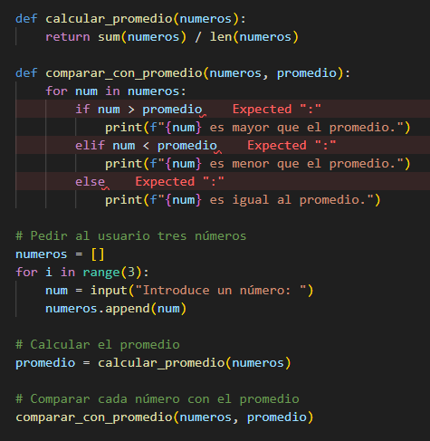
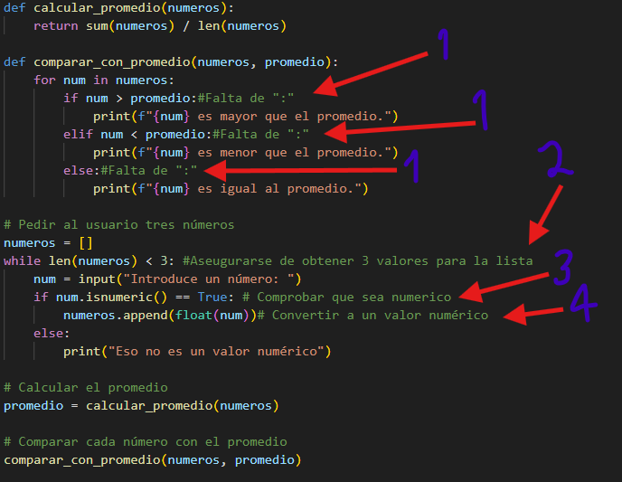

# Errores encontrados en Debugging.py
### Originalmente el codigo se veia de la siguiente manera:

  

### Pero luego se procedio a añadir unas correcciones y el codigo quedo así:

  

## __Correcciones__

- __1 - Representa las faltas de: `:`, que se encontraban en el codigo otriginal.__

- __2 - Es una modificación para que la lista tenga que contener tres valores antes de ser analizada.__

- __3 - Usa la función `.isnumeric` para comprobar que el valor ingresado sea numérico.__

- __4 - Usa la función `float` para convertirlo a un valor decimal.__